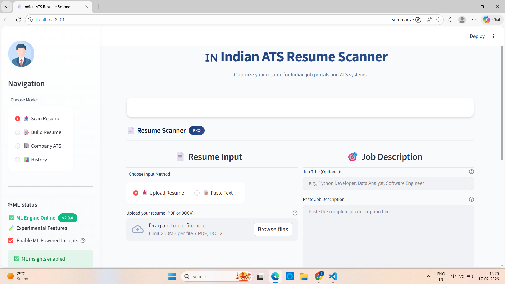
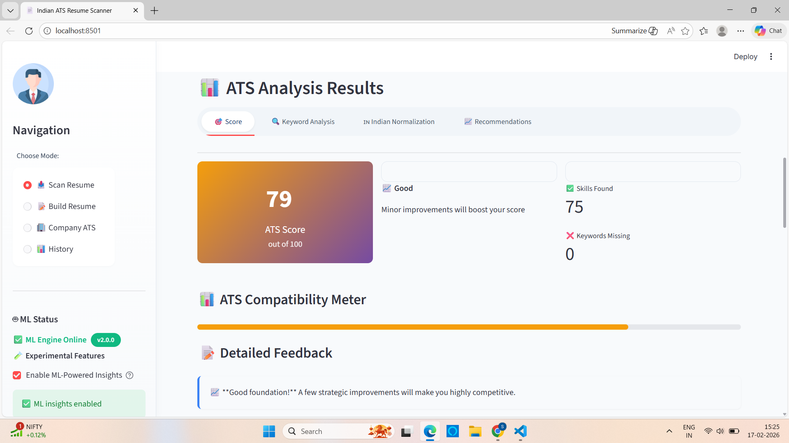
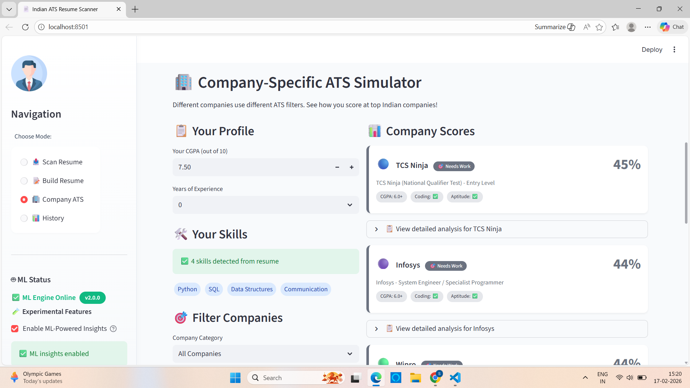
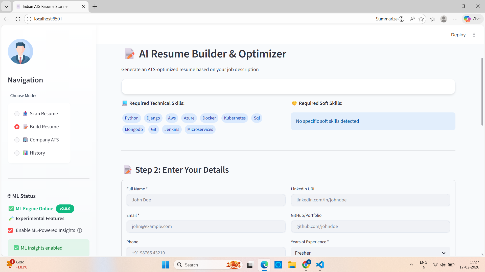

# 🇮🇳 Indian ATS Resume Scanner

[](https://python.org)
[](https://fastapi.tiangolo.com)
[](https://streamlit.io)
[](LICENSE)
[](https://www.sbert.net)

> An AI-powered resume optimization tool specifically designed for the Indian job market. Analyze your resume against job descriptions, get accurate ATS scores, and receive actionable feedback to improve your chances of landing interviews.

## ✨ Features

### 🎯 **Core ATS Scanner**
- **0-100 ATS Score** - Get a precise score with detailed breakdown
- **Keyword Gap Analysis** - Identify missing keywords from job descriptions
- **Semantic Matching** - ML-powered understanding of context, not just keywords
- **Real-time Feedback** - Actionable suggestions to improve your resume

### 🇮🇳 **Indian Market Specialization**
- **Degree Normalization** - Standardizes Indian degrees (B.Tech → Bachelor of Technology)
- **Company Recognition** - Identifies Indian companies (TCS, Infosys, Wipro, etc.)
- **Location Parsing** - Handles Indian city names (Bengaluru, Mumbai, Pune, etc.)

### 🏢 **Company-Specific ATS Simulator**
- Test your resume against top Indian recruiters:
  - TCS (Ninja & Digital)
  - Infosys (System Engineer & Power Programmer)
  - Wipro (Elite & Turbo)
  - Amazon India
  - Google India
  - Microsoft India
  - Accenture
  - Cognizant

### 📝 **Resume Builder**
- Create ATS-optimized resumes
- Industry-specific templates
- Action verb suggestions
- Real-time preview

### 📊 **Analytics & Tracking**
- Score history over time
- Improvement streak tracking
- Achievement badges
- Progress visualization

### 📄 **Export Options**
- PDF export with professional formatting
- JSON data export
- Plain text reports

### 🌐 **Chrome Extension**
- One-click scanning on job portals
- Supports Naukri, Indeed, LinkedIn India
- Instant ATS scores without copy-pasting

## 🛠️ **Tech Stack**

### Backend
- **Framework**: FastAPI
- **ML/NLP**: Sentence Transformers, spaCy, scikit-learn
- **PDF Processing**: pdfplumber, PyPDF2
- **Database**: SQLite (local), PostgreSQL (production)

### Frontend
- **Framework**: Streamlit
- **Visualization**: Plotly
- **Styling**: Custom CSS
- **PDF Generation**: fpdf2

### Deployment
- **Backend**: Render / Railway
- **Frontend**: Streamlit Cloud
- **Version Control**: GitHub

## 📦 **Installation**

### Prerequisites
- Python 3.10+
- pip
- Git

### Local Setup

```bash
# Clone the repository
git clone https://github.com/yourusername/ats-scanner.git
cd ats-scanner

# Backend setup
cd backend
python -m venv venv
source venv/bin/activate  # On Windows: venv\Scripts\activate
pip install -r requirements.txt
python -m spacy download en_core_web_sm

# Frontend setup
cd ../frontend
pip install -r requirements.txt

# Run the application
# Terminal 1 - Backend
cd backend
python app.py

# Terminal 2 - Frontend
cd frontend
streamlit run streamlit_app.py

🚀 Usage Guide
1. Scan Your Resume
a. Navigate to "📤 Scan Resume" mode
b. Upload your resume (PDF/DOCX) or paste text
c. Paste the job description
d. Click "ANALYZE RESUME WITH ATS"

2. Understand Your Results
a. ATS Score: 0-100 rating
b. Keyword Analysis: See matched and missing keywords
c. Indian Normalization: View standardized degrees/companies
d. Recommendations: Actionable improvement tips

3. Try Company Simulator
a. Switch to "🏢 Company ATS" mode
b. Your skills are automatically loaded from your resume
c. See how you score at different companies

4. Build an Optimized Resume
a. Go to "📝 Build Resume" mode
b. Fill in your details
c. Get an ATS-optimized resume

5. Track Your Progress
a. Visit "📊 History" mode
b. View score trends over time
c. Track improvements

🌐 Deployment
a. Deploy Backend to Render
b. Push code to GitHub
c. Create new Web Service on Render
d. Connect your repository
e. Set root directory to backend
f. Add environment variables if needed

Deploy Frontend to Streamlit Cloud
a. Push code to GitHub
b. Go to share.streamlit.io
c. Connect your repository
d. Set main file path to frontend/streamlit_app.py
e. Add backend URL as secret: API_URL = https://your-backend.onrender.com

📁 Project Structure
text
ats-scanner/
├── backend/               # FastAPI backend
│   ├── app.py
│   ├── ml/               # ML modules
│   │   ├── parser.py
│   │   ├── scorer.py
│   │   ├── semantic_matcher.py
│   │   └── ...
│   └── requirements.txt
├── frontend/              # Streamlit frontend
│   ├── streamlit_app.py
│   ├── components.py
│   ├── utils.py
│   ├── constants.py
│   └── requirements.txt
├── chrome-extension/      # Browser extension
│   ├── manifest.json
│   ├── popup.html
│   └── content.js
└── README.md


## 📸 **Screenshots**
### Resume Scanner Interface


### ATS Analysis Results


### Company-Specific Simulator


### Resume Builder
